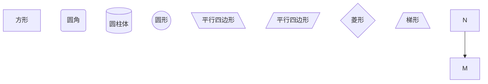
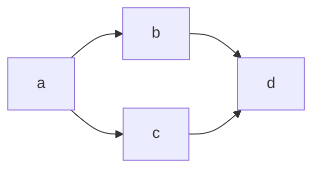
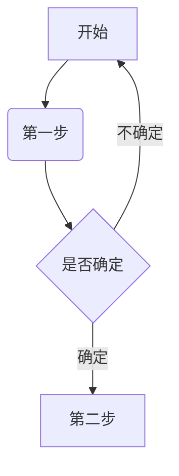

# markdown读写工具

Typora官网:https://typoraio.cn/

Typora 的 Markdown 语法：https://support.typoraio.cn/zh/Markdown-Reference/


[markdown官网](http://markdown.p2hp.com/basic-syntax/)

## 简介

markdown是一种轻量级的标记语言，易于读写，支持图片、图表、数学公式、流程图。用于帮助文档、博客等

标记语言：使用标记符号设定表现效果、内容结构、数据格式：例如html


## vscode插件：Markdown Preview Enhanced 预览

## 标题
```markdown
# 一级标题

## 二级标题

### 三级标题

#### 四级标题

##### 五级标题

###### 六级标题
```

## 无序列表和有序列表
```
有序列表

1. 有序列表1

2. 有序列表2


- 无序列表

+ 无序列表

* 无序列表

  * 二级无序列表

  + 二级无序列表

  - 二级无序列表

   + 三级无序列表
```

有序列表

1. 有序列表1

2. 有序列表2


- 无序列表

+ 无序列表

* 无序列表

  * 二级无序列表

  + 二级无序列表

  - 二级无序列表

   + 三级无序列表


## 复选框
```
- [x] 清单1

- [ ] 清单2
```

- [x] 清单1

- [ ] 清单2


## 文本
```
*斜体*   _斜体1_

**粗体**  __粗体1__

***粗斜体***   ___粗斜体1___

~~我是删除线~~

<u>我是下划线</u>

我有一段文字，但是我是<font color="red">红色的</font>
```

*斜体*   _斜体1_

**粗体**  __粗体1__

***粗斜体***   ___粗斜体1___

~~我是删除线~~

<u>我是下划线</u>

我有一段文字，但是我是<font color="red">红色的</font>

## 引用
```
> 一层引用

>> 二层引用

>>> 三层引用

....

>>>>> 多层引用

一层引用

二层引用

三层引用 ....

多层引用
```

> 一层引用

>> 二层引用

>>> 三层引用

....

>>>>> 多层引用

一层引用

二层引用

三层引用 ....

多层引用

## 分割线
```
--- 

___

***
```

--- 

___

***

## 图片
```

```


## 超链接
```
[百度](https://www.baidu.com)
```
[百度](https://www.baidu.com)


## 表格
```
| 属性          | 说明                                            | 类型          | 可选值     | 默认值 |
| :------------- | :----------------------------------------------- | ------------- | ---------- | ------ |
| month         | 按照月处理时间（负数-之前的时间 正数-之后时间） | number/string | ——         | ——     |

第二行分割表头和内容（使用-）

文字默认居左

-两边加：表示文字居中

-右边加：表示文字居右

-左边加：表示文字居左
```

| 属性          | 说明                                            | 类型          | 可选值     | 默认值 |
| :------------- | :----------------------------------------------- | ------------- | ---------- | ------ |
| month         | 按照月处理时间（负数-之前的时间 正数-之后时间） | number/string | ——         | ——     |


## 代码

（1）代码片段
```
`我是效果`
```
`我是效果`

（2）代码块

```markdown

我是markdown

```

```json

我是json

```

```js

我是js

```

```vue

我是vue

```


Markdown
我是多行代码

## 表情

[表情地址](https://www.webfx.com/tools/emoji-cheat-sheet/)
```
:smiley:

:star:

:star2:

```

:smiley:

:star:

:star2:


## 符号
```
符号
	说明
	对应编码(使用时去掉空格)
	英文怎么说

&
	AND 符号
	& amp;
	ampersand

<
	小于
	& lt;
	little

>
	大于
	& gt;
	great

 
	空格
	& nbsp;
	number space

¿
	倒问号
	& iquest;
	inverted question

```
[特殊符号链接](https://blog.csdn.net/tougue_java/article/details/123421206)

## 转义字符

```
使用\ 进行转义（排版混乱或者内容不全）

`反引号

*星号

——底线

{}花括号

[]方括号

()小括号

#井字号

+加好

-减号

！叹号
```
## 换行
```
<br />
```

## 目录
[toc]

## 流程图
基础图形：

[流程图基础](https://www.cnblogs.com/jinliang374003909/p/15265205.html)


流程图第一种写法





流程图第二种写法
```flow

  st=>start: 载入页面

  op1=>operation: 进入 window_display 回调

  op2=>operation: 执行显示图片API

  cond1=>condition: 计算当前图片是否处于当前行范围内

  op3=>operation: 读取图片数据(阻塞)

  op4=>operation: 填入显存

  cond2=>condition: 是否填满显存区域

  op5=>operation: 发送到屏幕

  cond3=>condition: 是否已执行至最后一行

  e=>end: 结束

 

  st->op1->op2->cond1

  cond1(yes)->op3

  cond1(no)->op2

  op3->op4->cond2

  cond2(yes)->op5

  cond2(no)->op2

  op5->cond3

  cond3(yes)->e

  cond3(no)->op2

```


[时序图、甘特图、饼图](https://blog.csdn.net/qq_36075612/article/details/118161100)

## 视频和音频

<video src="https://klxxcdn.oss-cn-hangzhou.aliyuncs.com/histudy/hrm/media/bg1.mp4" />

<audio  src="http://music.163.com/song/media/outer/url?id=1808492017.mp3"></audio>


